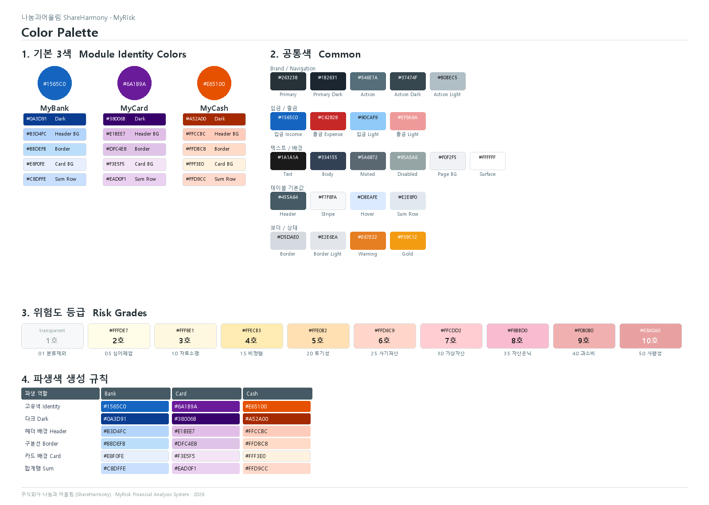

# 나눔과어울림 · MyRisk 색상 팔레트 가이드

> **주식회사 나눔과 어울림 (ShareHarmony)**
> 금융정보 분석 시스템 MyRisk — Color Palette Reference
> 작성일: 2026-03-11



---

## 1. 기본 3색 (모듈 고유색)

세 모듈이 각각 하나의 **Identity Color**를 가지며, 이를 기준으로 파생색(헤더, 배경, 구분선, 호버, 합계행)이 결정됩니다.

### MyBank — 블루 계열

| 역할 | Hex | 견본 | 설명 |
|---|---|---|---|
| **고유색** | `#1565C0` |  | 타이틀, 통계 텍스트, 배지 |
| 다크 | `#0A3D91` |  | 카드 제목(h2) |
| 헤더 배경 | `#B3D4FC` |  | 테이블 헤더 배경 (파스텔 블루) |
| 구분선 | `#BBDEFB` |  | 테이블 셀 보더, 헤더 하단선 |
| 카드 배경 | `#E8F0FE` |  | 홈 서비스 카드 배경 |
| 합계행 | `#C8DFFE` |  | 합계행 배경 |

### MyCard — 딥 퍼플 계열

| 역할 | Hex | 견본 | 설명 |
|---|---|---|---|
| **고유색** | `#6A1B9A` |  | 타이틀, 통계 텍스트, 배지 |
| 다크 | `#38006B` |  | 카드 제목(h2) |
| 헤더 배경 | `#E1BEE7` |  | 테이블 헤더 배경 (파스텔 퍼플) |
| 구분선 | `#DFC4E8` |  | 테이블 셀 보더, 헤더 하단선 |
| 카드 배경 | `#F3E5F5` |  | 홈 서비스 카드 배경, 호버 |
| 합계행 | `#EAD0F1` |  | 합계행 배경 |

### MyCash — 딥 오렌지 계열

| 역할 | Hex | 견본 | 설명 |
|---|---|---|---|
| **고유색** | `#E65100` |  | 타이틀, 통계 텍스트, 배지 |
| 다크 | `#A52A00` |  | 카드 제목(h2) |
| 헤더 배경 | `#FFCCBC` |  | 테이블 헤더 배경 (파스텔 오렌지) |
| 구분선 | `#FFDBC8` |  | 테이블 셀 보더, 헤더 하단선 |
| 카드 배경 | `#FFF3E0` |  | 홈 서비스 카드 배경 |
| 호버 | `#FBE9E7` |  | 행 호버 배경 |
| 합계행 | `#FFD9CC` |  | 합계행 배경 |

> **MyCash 병합 페이지**에서는 은행 테이블에 Bank 색상, 카드 테이블에 Card 색상을 그대로 적용하고, 카테고리·분석 테이블만 Cash 고유색을 사용합니다.

---

## 2. 공통색 (Common — `common.css` :root)

모든 모듈이 공유하는 색상입니다. 각 모듈은 고유색으로 일부 변수를 override합니다.

### Brand / Navigation

| 역할 | 변수명 | Hex | 견본 | 설명 |
|---|---|---|---|---|
| Primary | `--color-primary` | `#263238` |  | 네비게이션 바, 타이틀 (Blue Grey 900) |
| Primary Dark | `--color-primary-dark` | `#1B2631` |  | 홈 상단 네비 |
| Action | `--color-action` | `#546E7A` |  | 실행 버튼, 활성 탭 (Blue Grey 600) |
| Action Dark | `--color-action-dark` | `#37474F` |  | 버튼 호버 |
| Action Light | `--color-action-light` | `#B0BEC5` |  | 보조 하이라이트 (Blue Grey 200) |

### 입금 / 출금

| 역할 | 변수명 | Hex | 견본 | 설명 |
|---|---|---|---|---|
| 입금 | `--color-income` | `#1565C0` |  | 입금 금액 (파란색) |
| 출금 | `--color-expense` | `#C62828` |  | 출금 금액 (빨간색) |
| 입금 (밝은) | `--color-income-light` | `#90CAF9` |  | 어두운 배경 위 입금 표시 |
| 출금 (밝은) | `--color-expense-light` | `#EF9A9A` |  | 어두운 배경 위 출금 표시 |

### 텍스트 / 배경

| 역할 | 변수명 | Hex | 견본 | 설명 |
|---|---|---|---|---|
| 본문 텍스트 | `--color-text` | `#1A1A1A` |  | 고대비 16:1 |
| 테이블 본문 | — | `#334155` |  | Slate 700, 테이블 셀 텍스트 |
| 보조 텍스트 | `--color-text-muted` | `#5A6872` |  | 메타정보, 타임스탬프 |
| 비활성 | `--color-disabled` | `#95A5A6` |  | 비활성 요소 |
| 페이지 배경 | `--color-bg` | `#F0F2F5` |  | 카드·표와 구분 |
| 표면 | `--color-surface` | `#FFFFFF` |  | 카드, 패널, 모달 배경 |

### 테이블 (공통 기본값)

| 역할 | 변수명 | Hex | 견본 | 설명 |
|---|---|---|---|---|
| 헤더 배경 | `--color-table-header` | `#455A64` |  | Blue Grey 700 |
| 헤더 텍스트 | `--color-table-header-text` | `#FFFFFF` |  | 흰색 |
| 짝수행 | `--color-table-stripe` | `#F7F8FA` |  | 거의 흰색, 미세 구분 |
| 호버 | `--color-table-hover` | `#DBEAFE` |  | 라이트 블루 (적녹색약 안전) |
| 합계행 | `--color-table-sum` | `#E2E8F0` |  | 중간 밝기 |

### 보더 / 상태

| 역할 | 변수명 | Hex | 견본 | 설명 |
|---|---|---|---|---|
| 보더 | `--color-border` | `#D5DAE0` |  | 기본 구분선 |
| 보더 (밝은) | `--color-border-light` | `#E2E6EA` |  | 보조 구분선 |
| 경고 | `--color-warning` | `#E67E22` |  | Muted Orange |
| 골드 | `--color-gold` | `#F39C12` |  | 강조 |

---

## 3. 위험도 등급 색상 (Risk Grade)

위험도 1호~10호 단계별 배경색입니다. 텍스트 가독성 우선, 저채도·고명도 톤.

| 등급 | 위험도 | Hex | 견본 | 설명 |
|---|---|---|---|---|
| 1호 | 0.1 분류제외 | `transparent` | — | 투명 |
| 2호 | 0.5 심야폐업 | `#FFFDE7` |  | 아주 연한 노란 |
| 3호 | 1.0 자료소명 | `#FFF8E1` |  | 연한 노란 |
| 4호 | 1.5 비정형 | `#FFECB3` |  | 연한 주황노란 |
| 5호 | 2.0 투기성 | `#FFE0B2` |  | 연한 주황 |
| 6호 | 2.5 사기파산 | `#FFD6C9` |  | 연한 살구 |
| 7호 | 3.0 가상자산 | `#FFCDD2` |  | 연한 분홍 |
| 8호 | 3.5 자산은닉 | `#F8BBD0` |  | 연한 핑크 |
| 9호 | 4.0 과소비 | `#F0B0B0` |  | 연한 로즈 |
| 10호 | 5.0 사행성 | `#E8A0A0` |  | 연한 살몬 |

---

## 4. 색상 적용 구조

```
common.css (:root)
  └─ 공통 변수 정의 (Brand, 입출금, 텍스트, 테이블, 보더, 위험도)

templates/index.html (홈)
  └─ 기본 3색으로 서비스 카드 스타일링

MyBank/templates/*.html
  └─ 고유색 #1565C0 기반 인라인 override

MyCard/templates/*.html
  └─ 고유색 #6A1B9A 기반 인라인 override

MyCash/templates/*.html
  └─ 고유색 #E65100 기반 인라인 override
  └─ 병합 테이블: Bank/Card 색상 병행 사용
```

### 파생색 생성 규칙

각 모듈의 고유색(Identity)에서 파생색을 만드는 패턴:

| 파생 역할 | 방법 | Bank 예시 | Card 예시 | Cash 예시 |
|---|---|---|---|---|
| 헤더 배경 | 고유색 + 높은 명도, 낮은 채도 | `#B3D4FC` | `#E1BEE7` | `#FFCCBC` |
| 구분선 | 헤더보다 약간 밝게 | `#BBDEFB` | `#DFC4E8` | `#FFDBC8` |
| 카드 배경 | 매우 연한 파스텔 | `#E8F0FE` | `#F3E5F5` | `#FFF3E0` |
| 호버 | 카드 배경과 유사 | `#DBEAFE` | `#F3E5F5` | `#FBE9E7` |
| 합계행 | 헤더와 카드 사이 밝기 | `#C8DFFE` | `#EAD0F1` | `#FFD9CC` |
| 다크 | 고유색보다 어둡게 | `#0A3D91` | `#38006B` | `#A52A00` |

---

## 5. 접근성 참고

- **입금/출금**: 파란색(`#1565C0`)과 빨간색(`#C62828`)은 적녹색약 사용자도 구분 가능한 청-적 조합.
- **텍스트 대비**: 본문 `#1A1A1A` on `#FFFFFF` = 약 16:1 비율 (WCAG AAA).
- **위험도 배경**: 저채도·고명도로 텍스트 가독성을 우선.
- **다크 모드**: `common.css`에서 라이트 테마를 강제하여 dark 시스템 설정을 무시합니다.

---

## 6. 참고 파일

| 파일 | 위치 |
|---|---|
| 공통 CSS | `static/common.css` |
| 홈 페이지 | `templates/index.html` |
| Bank 고유색 | `MyBank/templates/index.html` (1810행~) |
| Card 고유색 | `MyCard/templates/index.html` (1527행~) |
| Cash 고유색 | `MyCash/templates/index.html` (1524행~) |
