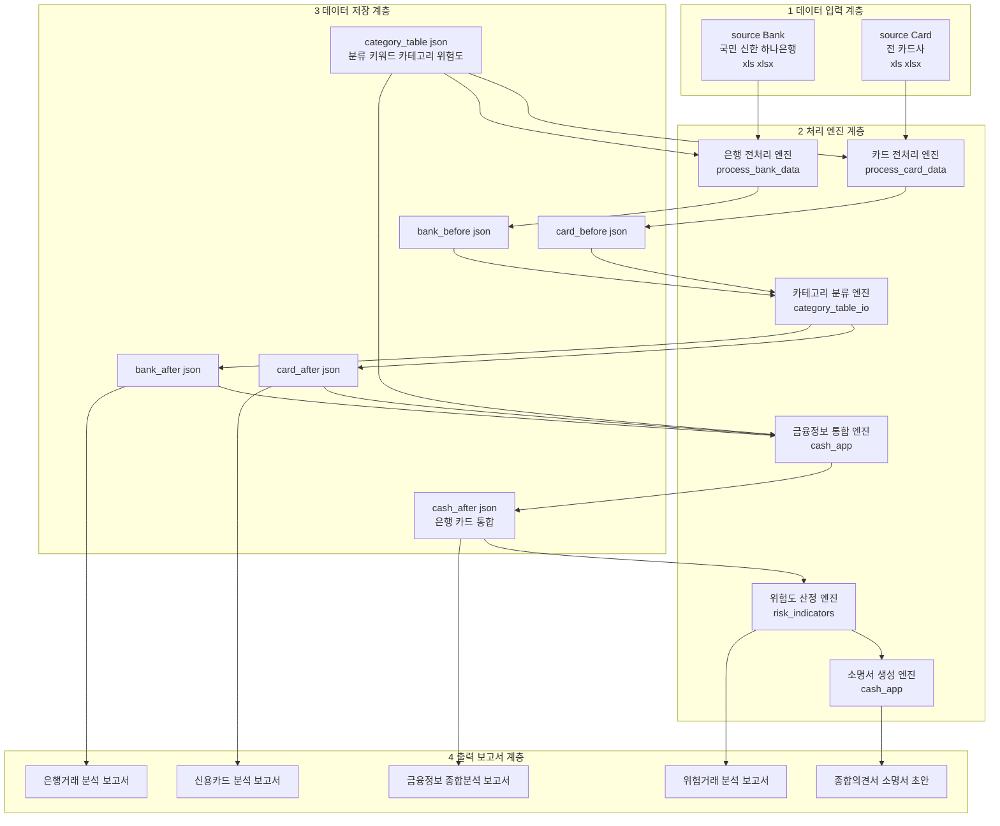
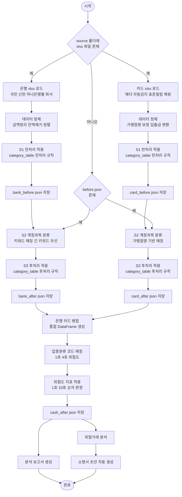
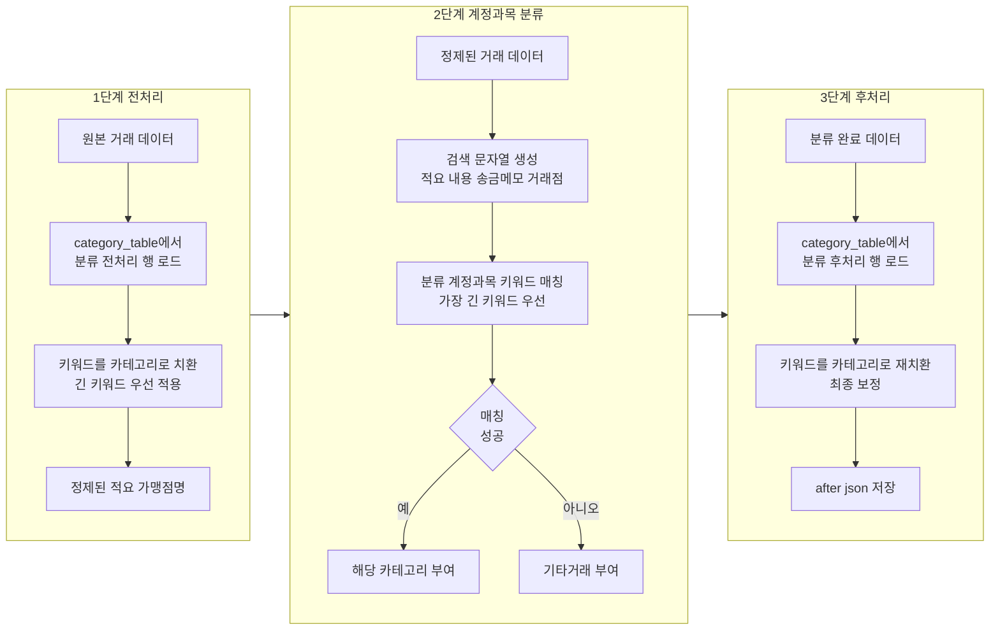
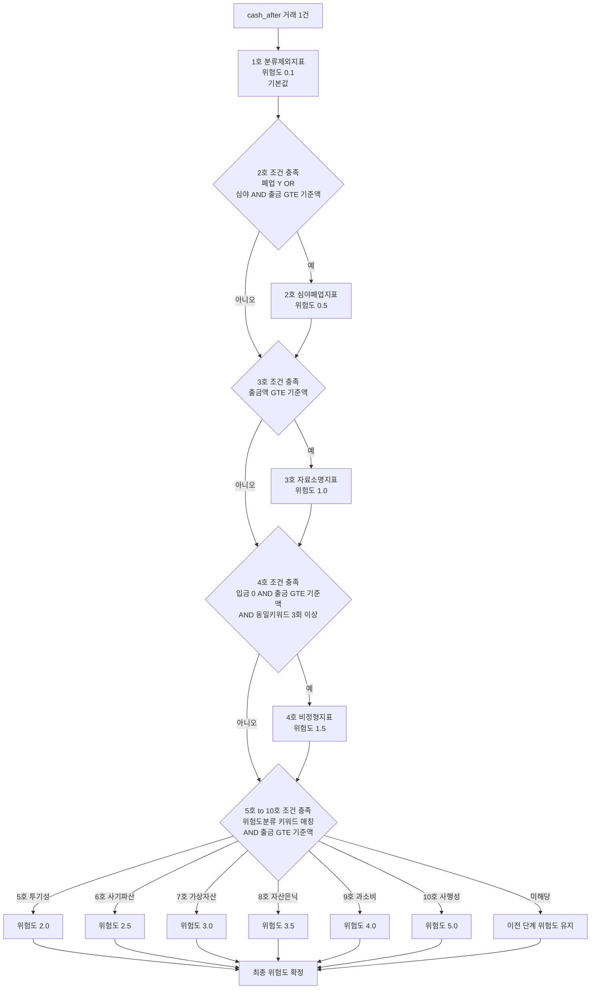
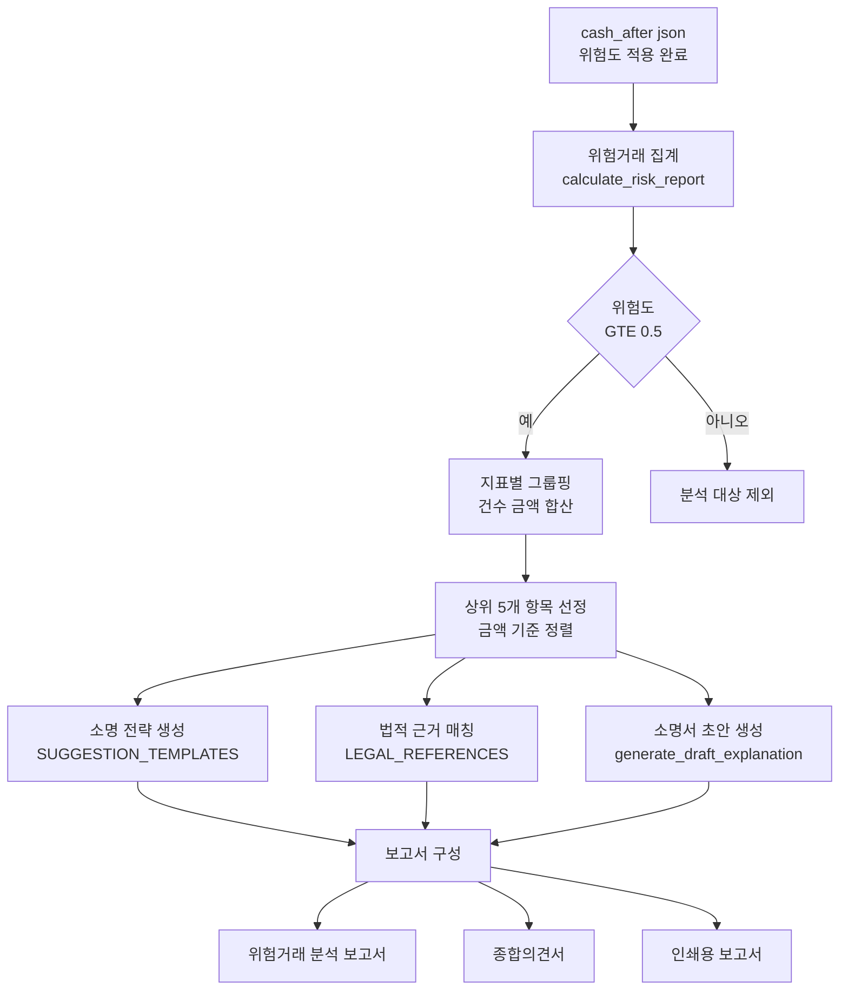
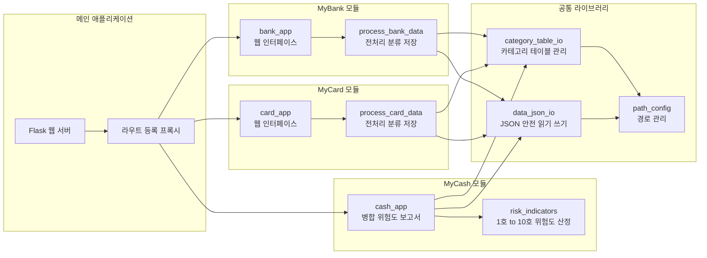

# MyRisk 시스템 구성도 · 순서도

> **특허 명세서 첨부용 기술 문서**
> 주식회사 나눔과 어울림 ShareHarmony · 금융정보 분석 시스템 MyRisk
> 작성일: 2026-03-09

---

## 1. 시스템 전체 구성도

> Mermaid Live Editor에 아래 코드 블록 내용만 붙여넣기



---

## 2. 데이터 처리 순서도 - 전체 파이프라인



---

## 3. 카테고리 3단계 분류 상세도



### 카테고리 테이블 구조

| 컬럼 | 설명 | 예시 |
|------|------|------|
| **분류** | 처리 단계 구분 | `전처리`, `계정과목`, `후처리`, `위험도분류`, `심야구분` |
| **키워드** | 매칭 대상 문자열 | `카카오페이`, `스타벅스`, `국민연금` |
| **카테고리** | 분류 결과 | `간편결제`, `식음료`, `사회보험` |
| **위험도** | 위험도 등급 5호~10호 | `5호`, `6호`, `7호` |
| **업종코드** | 최소 금액 기준 등 | `50000` 원 |

---

## 4. 위험도 산정 순서도 - 1호~10호 지표



### 위험도 지표 상세 정의

| 호수 | 지표명 | 위험도 값 | 판정 조건 | 법적 근거 |
|------|--------|----------|----------|----------|
| 1호 | 분류제외지표 | 0.1 | 2~10호 미해당 기본값 | - |
| 2호 | 심야폐업지표 | 0.5 | 폐업 업소 OR 심야시간대 AND 출금 GTE 기준 | 채무자회생법 제564조 |
| 3호 | 자료소명지표 | 1.0 | 출금액 GTE 기준액 | 채무자회생법 제564조 |
| 4호 | 비정형지표 | 1.5 | 입금 0원 출금 GTE 기준 동일키워드 3회 이상 반복 | 채무자회생법 제564조 |
| 5호 | 투기성지표 | 2.0 | 위험도분류 투기 키워드 출금 GTE 기준 | 동법 제564조 1항 5호 |
| 6호 | 사기파산지표 | 2.5 | 위험도분류 사기 키워드 출금 GTE 기준 | 동법 제564조 1항 2호 |
| 7호 | 가상자산지표 | 3.0 | 위험도분류 가상자산 키워드 출금 GTE 기준 | 동법 제564조 1항 5호 |
| 8호 | 자산은닉지표 | 3.5 | 위험도분류 은닉 키워드 출금 GTE 기준 | 동법 제564조 1항 1호 |
| 9호 | 과소비지표 | 4.0 | 위험도분류 과소비 키워드 출금 GTE 기준 | 동법 제564조 1항 5호 |
| 10호 | 사행성지표 | 5.0 | 위험도분류 사행성 키워드 출금 GTE 기준 | 동법 제564조 1항 5호 |

> **심야시간대**: category_table 심야구분 행에서 정의 기본 22시~06시
> **기준액**: category_table 위험도분류 행의 업종코드 값 단위 원
> **GTE**: 이상 Greater Than or Equal

---

## 5. 소명서 자동 생성 순서도



### 소명서 초안 생성 방식

```
입력: 지표명, 거래 건수, 총 금액

generate_draft_explanation("가상자산지표", 5, "3,500,000원")

출력:
"위 가상자산 관련 거래 5건(3,500,000원)은 투자 목적이었으며,
 현재는 모든 가상자산 계정을 해지하였고, 향후 가상자산 거래를
 하지 않겠습니다."

※ 지표별 10종의 법적 소명 템플릿 내장
```

---

## 6. 모듈 구성도



---

## 7. 발명의 핵심 청구항 구성 참고

```
[청구항 1]

금융기관 발행 거래 내역 데이터를 입력받는 수신 단계;

사전 정의된 카테고리 테이블을 이용하여
전처리, 계정과목 분류, 후처리의 3단계로
상기 거래 내역을 자동 분류하는 분류 단계;

이기종 금융 데이터(은행 거래 + 신용카드 거래)를
단일 통합 데이터로 병합하는 통합 단계;

상기 통합 데이터의 각 거래에 대해
소정의 위험도 지표(1호~10호)를 순차 적용하여
위험도 점수를 산정하는 위험도 산정 단계;

산정된 위험도에 기초하여 법적 소명 문안을
자동 생성하는 소명서 생성 단계;

를 포함하는, 법원 회생/파산/면책 절차를 위한
금융 거래 위험도 분석 및 소명서 자동 생성 방법.


[청구항 2]

제1항에 있어서,
상기 위험도 산정 단계는
기본값(1호, 0.1)을 부여한 후
2호(심야폐업)~10호(사행성)를 순차 판정하되,
상위 호수 조건 충족 시 하위 호수를 덮어쓰는
단계적 위험도 상향 방식인 것을 특징으로 하는 방법.


[청구항 3]

제1항에 있어서,
상기 3단계 분류에서
전처리는 원본 데이터의 비정형 텍스트를 정규화하고,
계정과목 분류는 키워드 길이 역순으로 매칭하여
최장 일치(Longest Match) 방식으로 분류하며,
후처리는 분류 결과를 법적 용어로 재정규화하는 것을
특징으로 하는 방법.
```

---

## 8. 용어 정의

| 용어 | 정의 |
|------|------|
| **전처리** | 금융기관별로 상이한 원본 데이터의 적요 가맹점명을 표준화하는 과정 |
| **계정과목 분류** | 표준화된 거래 텍스트를 사전 정의된 키워드와 대조하여 회계 카테고리를 부여하는 과정 |
| **후처리** | 분류 완료된 데이터에 대해 법적 절차에 적합한 용어로 최종 보정하는 과정 |
| **위험도 지표** | 채무자회생법 제564조에 근거한 면책불허가 사유 해당 여부를 수치화한 등급 0.1~5.0 |
| **소명서 초안** | 위험 거래에 대해 채무자가 법원에 제출할 해명 문안의 자동 생성본 |
| **카테고리 테이블** | 분류 키워드 카테고리 위험도를 정의한 규칙 데이터베이스 |
| **최장 일치 방식** | 복수의 키워드가 동시에 매칭될 때 가장 긴 키워드를 우선 적용하는 알고리즘 |
| **GTE** | 이상 Greater Than or Equal |

---

> **본 문서의 Mermaid 다이어그램은 특허 명세서 첨부 시 이미지로 변환하여 사용합니다.**
> 각 다이어그램을 개별적으로 Mermaid Live Editor에 붙여넣어 이미지로 변환하세요.
> 변환 도구: https://mermaid.live
