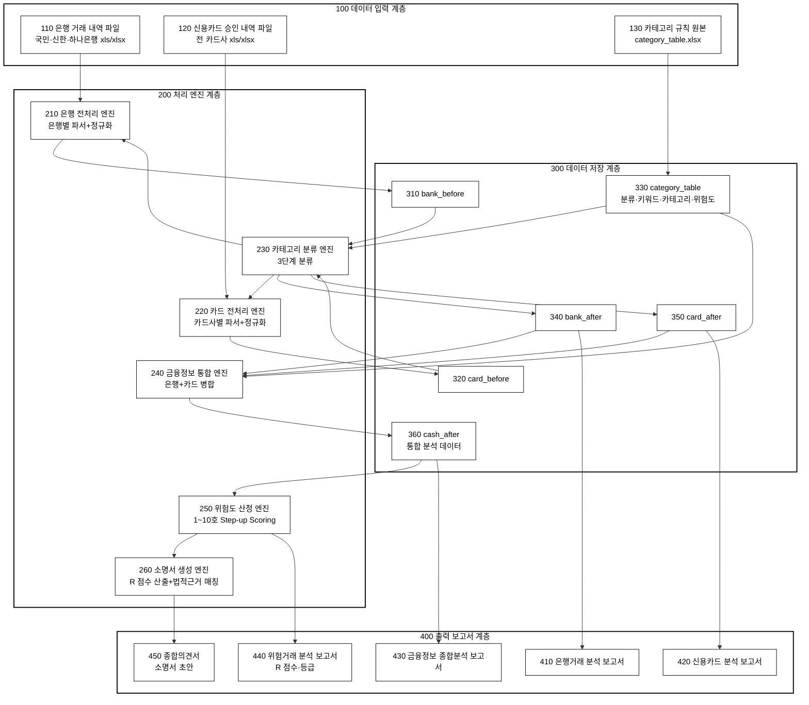
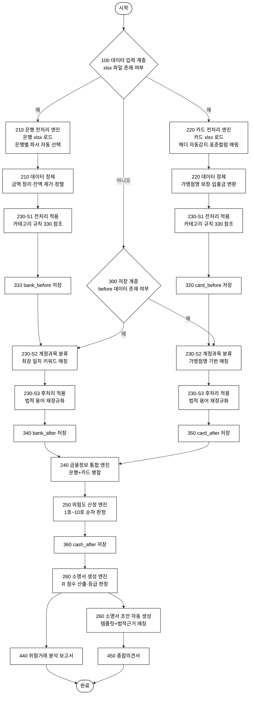
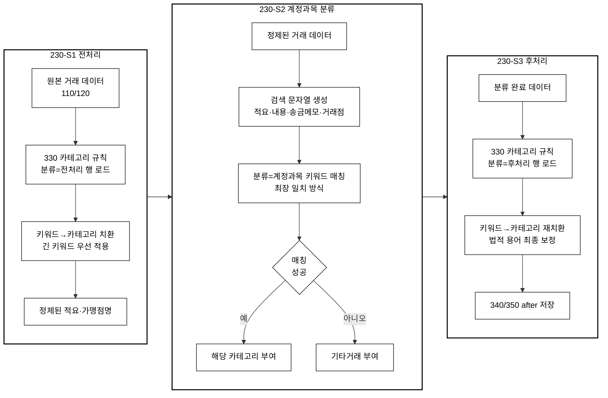
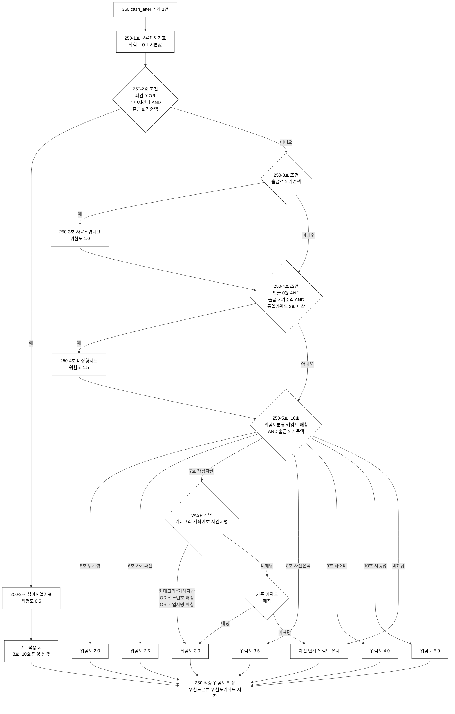
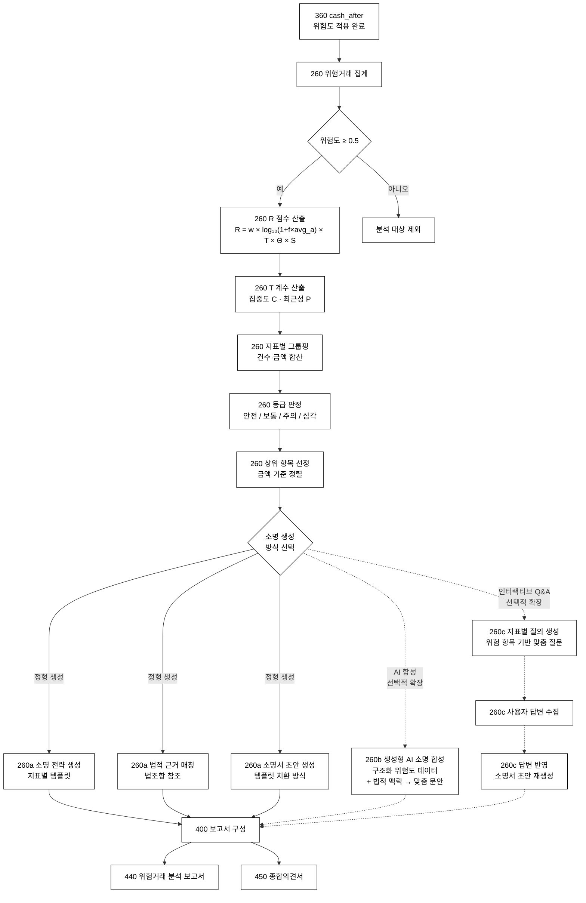
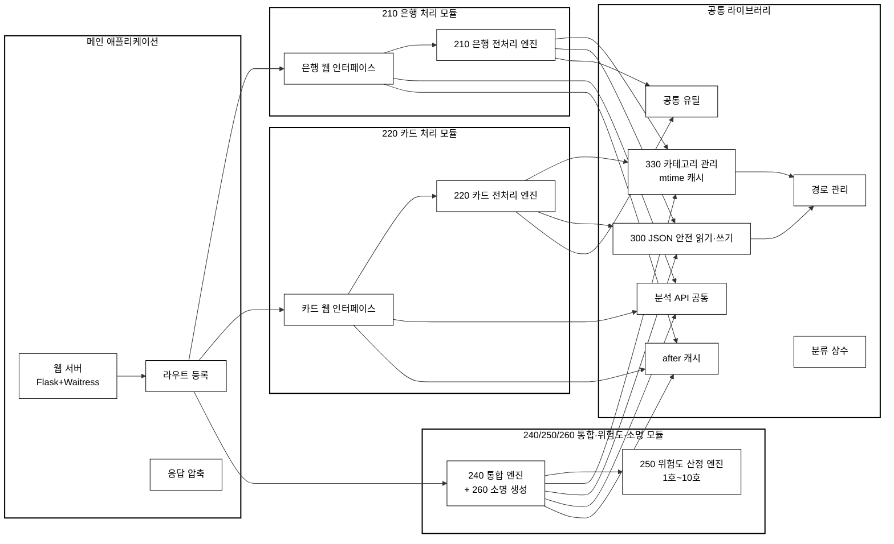

# MyRisk 시스템 구성도 · 순서도

> **특허 명세서 첨부용 기술 문서**
> 주식회사 나눔과 어울림 ShareHarmony · 금융정보 분석 시스템 MyRisk v200
> 작성일: 2026-03-15

---

## 1. 시스템 전체 구성도

> 특허 도면 스타일: 흑백 선화, 부호 번호(100~450) 기입, 고딕 계열 글꼴 통일
> Mermaid Live Editor에 아래 코드 블록 내용만 붙여넣기 → PNG/SVG 변환



---

## 2. 데이터 처리 순서도 — 전체 파이프라인



---

## 3. 카테고리 3단계 분류 상세도



### 카테고리 테이블 구조 (category_table.json)

| 컬럼 | 설명 | 예시 |
|------|------|------|
| **분류** | 처리 단계 구분 | `전처리`, `계정과목`, `후처리`, `위험도분류`, `업종분류`, `심야구분`, `VASP계좌`, `신청인` |
| **키워드** | 매칭 대상 문자열 | `카카오페이`, `스타벅스`, `국민연금` |
| **카테고리** | 분류 결과 | `간편결제`, `식음료`, `사회보험` |
| **위험도** | 위험도 수치 (5호~10호) | `2.0`, `3.0`, `5.0` |
| **위험지표** | 최소 출금액 기준 (원) | `50000`, `100000` |

### 업종분류와 법적 근거

카테고리 테이블의 **분류=업종분류** 행은 거래 적요·가맹점명에서 추출한 사업자의 업종을
법적으로 정의된 업종 분류 체계와 대조하여 위험도 산정의 보조 판단 자료로 활용한다.

특히, **중소기업진흥에 관한 법률 시행령 제33조제1항제2호가목 [별표 1]**에서 규정하는
**협업기업 선정에서 제외되는 업종** (사행시설관리·운영업, 무도장운영업, 주점업 등)은
채무자회생법 제564조의 면책불허가 사유인 **사치·낭비·사행행위** 판단과 직접적으로
연관되므로, 해당 업종 목록을 카테고리 테이블에 포함하여 위험도 지표 5호(투기성)·
9호(과소비)·10호(사행성) 판정의 근거 데이터로 활용한다.

| 법적 근거 | 적용 영역 |
|-----------|----------|
| 중소기업진흥에 관한 법률 시행령 [별표 1] 협업기업 제외 업종 | 업종분류 키워드 소스 — 사행·유흥·도박 관련 업종 식별 |
| 통계청 한국표준산업분류(KSIC) 10차 | 업종코드 체계 기반 분류 |
| 국세청 기준(단순)경비율 업종코드 | 사업자번호 기반 업종 대조 |
| 채무자회생법 제564조 1항 각호 | 위험도 지표 1~10호 최종 판정 |

### 외부 사업자 검증 — 선택적 확장 경로

현재 시스템은 금융기관이 제공하는 거래내역(xls/xlsx)의 텍스트 정보(적요·가맹점명·
사업자번호)만을 기반으로 분류 및 위험도를 산정한다. 다른 실시예에서는 외부 API를
통해 사업자등록번호의 업종 정보를 조회·대조하여 분류 정확도를 높일 수 있다.

다만, 현재 이 확장이 적용되지 않는 이유는 기술적 한계가 아닌 **법적·제도적 제약**
에 기인한다:

| 제약 요인 | 상세 |
|-----------|------|
| 금융기관 제공 데이터의 한계 | 은행 이체 내역에는 사업자등록번호가 포함되지 않으며, 카드 매출전표에만 일부 포함 |
| 개인정보보호법 | 사업자등록번호 조회·대조 시 정보주체 동의 또는 법률상 근거 필요 |
| 국세청 업종분류 접근 제한 | 주업종/부업종 코드만 공개 조회 가능. 상세 업태·종목은 사업자 본인만 조회 |
| VAN/PG 사업자 정보 | 가맹점 상세 정보(업종·폐업 여부) 조회 시 사업자등록번호·본인 동의 등 별도 절차 필요 |
| 실명확인법·전자금융거래법 | API 연동 시 본인확인·전자서명 등 추가 법적 절차 요구 가능 |

상기 법적·제도적 장치가 보완되는 경우, 시스템은 다음과 같이 확장될 수 있다:
1. 카드 매출전표의 사업자등록번호를 국세청 API로 조회하여 업종 자동 분류
2. VAN/PG 사업자 API를 통해 가맹점 폐업 여부를 실시간 확인
3. 은행 이체의 수취인 계좌에 대해 금융정보분석원(FIU) 등록 정보를 대조

---

## 4. 위험도 산정 순서도 — 1호~10호 지표



### 위험도 지표 상세 정의

| 호수 | 지표명 | 위험도 값 | 판정 조건 | 법적 근거 |
|------|--------|----------|----------|----------|
| 1호 | 분류제외지표 | 0.1 | 2~10호 미해당 기본값 | — |
| 2호 | 심야폐업지표 | 0.5 | 폐업 업소 OR 심야시간대 AND 출금 GTE 기준액 | 채무자회생법 제564조 |
| 3호 | 자료소명지표 | 1.0 | 출금액 GTE 기준액 | 채무자회생법 제564조 |
| 4호 | 비정형지표 | 1.5 | 입금 0원·출금 GTE 기준액·동일키워드 3회 이상 반복 | 채무자회생법 제564조 |
| 5호 | 투기성지표 | 2.0 | 위험도분류 투기 키워드·출금 GTE 기준액 | 동법 제564조 1항 5호 |
| 6호 | 사기파산지표 | 2.5 | 위험도분류 사기 키워드·출금 GTE 기준액 | 동법 제564조 1항 2호 |
| 7호 | 가상자산지표 | 3.0 | 카테고리=가상자산 OR VASP 가상계좌 접두번호 매칭 OR VASP 사업자명 매칭·출금 GTE 기준액 | 동법 제564조 1항 5호 |
| 8호 | 자산은닉지표 | 3.5 | 위험도분류 은닉 키워드·출금 GTE 기준액 | 동법 제564조 1항 1호 |
| 9호 | 과소비지표 | 4.0 | 위험도분류 과소비 키워드·출금 GTE 기준액 | 동법 제564조 1항 5호 |
| 10호 | 사행성지표 | 5.0 | 위험도분류 사행성 키워드·출금 GTE 기준액 | 동법 제564조 1항 5호 |

> **심야시간대**: category_table 분류=심야구분 행의 키워드로 정의 (기본 22:00~06:00)
> **기준액**: category_table 분류=위험도분류 행의 위험지표 값 (단위: 원)
> **GTE**: 이상 (Greater Than or Equal)
> **2호 적용 행**: 2호 조건 충족 시 해당 행은 3~10호 조건을 판정하지 않음

---

## 5. 위험도 분석 리포트 · 소명서 자동 생성 순서도



### R 점수 산출 공식

```
R = w × log₁₀(1 + f × avg_a) × T × Θ × S

w    : 위험도 가중치 (1호 0.1 ~ 10호 5.0)
f    : 해당 지표 거래 건수
avg_a: 해당 지표 평균 거래 금액
T    : 시계열 근접성 계수 (1.00 ~ 1.50)
Θ    : 동적 임계 계수 (0.00 ~ 2.60)
S    : 입출금 대칭성 계수 (0.30 ~ 1.00)

T = 1 + α × C + β × P
  C (집중도) = 1 − (활동기간 / 전체분석기간)
  P (최근성) = 최근25%구간 거래건수 / 전체건수
  α = 0.3, β = 0.2

Θ = amount_factor × count_factor
  amount_factor:
    금액 < threshold       → 금액 / threshold (선형 감점)
    threshold ≤ 금액 ≤ 3×threshold → 1.0 (기본)
    금액 > 3×threshold     → 1 + γ × log₂(금액/threshold) (누진 가중, 상한 2.0)
  count_factor:
    건수 ≥ count_threshold → 1 + δ × (건수/count_threshold − 1) (상한 1.3)
    건수 < count_threshold → 1.0
  γ = 0.1, δ = 0.05, count_threshold = 10

S = 1 − (입금합계 / 출금합계)
  적용 대상: 투기성지표(5호), 가상자산지표(7호), 자산은닉지표(8호)
  입금(회수) 비율이 높을수록 S가 낮아져 R을 감소 (순유출액 기반 보정)
  하한 0.3: 완전 회수 시에도 최소 위험도 유지
  비적용 지표: S = 1.0 (보정 없음)

등급 (전체 합산):
  R합계 < 50  → 안전(Safe): 면책 허가 가능성 높음
  R합계 < 100 → 보통(Normal): 일부 특이 지출 소명 필요
  R합계 < 150 → 주의(Caution): 소명 자료 준비 필수
  R합계 ≥ 150 → 심각(Critical): 상세 사유서 필수 작성

등급 (항목별):
  R < 10  → 안전(Safe)
  R < 20  → 보통(Normal)
  R < 30  → 주의(Caution)
  R ≥ 30  → 심각(Critical)
```

### 소명서 초안 생성 방식

#### (a) 정형 생성 — 템플릿 치환 방식 (현재 구현)

```
입력: 지표명, 거래 건수, 총 금액

_generate_draft_explanation("가상자산지표", 5, "3,500,000원")

출력:
"위 가상자산 관련 거래 5건(3,500,000원)은 투자 목적이었으며,
 현재는 모든 가상자산 계정을 해지하였고, 향후 가상자산 거래를
 하지 않겠습니다."

※ 지표별 10종의 법적 소명 템플릿(SUGGESTION_TEMPLATES) 내장
※ 법조항 참조(LEGAL_REFERENCES) 자동 매칭
```

#### (b) 생성형 AI 소명 합성 — 선택적 확장 경로

```
입력: 구조화된 위험도 분석 결과 (지표명, R 점수, T 계수, 건수, 금액)
     + 법적 맥락 (LEGAL_REFERENCES, 채무자회생법 조문)
     + 사건 개별 정보 (채무자 직업, 가족 구성 등 선택적)

처리: 자연어 생성 모델(LLM)에 구조화 데이터와 법적 프롬프트를 전달

출력: 사건별 맞춤 소명 문안 (법률 용어·판례 참조 포함)

※ 정형 생성(a)의 템플릿 출력을 기본값으로 하되,
  AI 합성 결과가 가용한 경우 이를 우선 사용
※ AI 합성 불가 시 자동으로 정형 생성(a)으로 폴백
```

#### (c) 인터랙티브 질의응답 — 선택적 확장 경로

```
[1단계: 질의 생성]
  입력: 위험도 분석 결과 (상위 위험 항목, 지표명, R 점수, 법조항)
  처리: 지표별 사전 정의된 질의 템플릿에서 맞춤 질문 생성

  예시 (가상자산지표, R=12.5):
    Q1. "가상자산 거래 5건(3,500,000원)의 투자 원금 출처는?"
    Q2. "현재 가상자산 보유 여부 및 잔여 수량은?"
    Q3. "향후 거래 중단 의사가 있습니까?"

[2단계: 답변 수집]
  사용자가 UI를 통해 각 질문에 답변 입력
  미답변 항목은 기본값(정형 생성 문구) 유지

[3단계: 답변 반영 재생성]
  수집된 답변을 소명서 초안 템플릿의 가변 구간에 치환
  정형 생성(a)의 자동 문구를 사용자 실제 답변으로 대체

  출력 예시:
  "위 가상자산 관련 거래 5건(3,500,000원)은 퇴직금 일부를
   사용한 투자 목적이었으며, 현재 보유 자산은 없습니다.
   향후 가상자산 거래를 하지 않겠습니다."

※ 정형 생성(a)을 기본값으로 하되,
  사용자 답변이 입력된 항목만 선택적으로 교체
※ 답변 미입력 시 정형 생성(a) 문구를 그대로 유지 (폴백)
```

---

## 6. 모듈 구성도



### lib/ 모듈 상세

| 모듈 | 역할 |
|------|------|
| path_config | 프로젝트 루트·data·.source 경로 중앙 관리 |
| data_json_io | DataFrame ↔ JSON 안전 읽기·쓰기 (datetime·numpy 변환) |
| category_table_io | category_table.json 로드·저장·정규화·액션·mtime 캐시 |
| after_cache | bank_after·card_after·cash_after mtime 기반 캐시 |
| analysis_common | 분석 API 공통 로직 (summary·by-category·by-month 등 12종) |
| category_constants | 분류 상수 (CLASS_PRE·CLASS_POST·RISK_CLASS_TO_VALUE 등) |
| shared_app_utils | 공통 유틸 (setup_win32_utf8·safe_str·json_safe 등) |
| category_table_defaults | 기본 규칙·.source/xlsx → json 동기화 |
| audit_report | 계정과목 전수조사 HTML 검수보고서 생성 |
| excel_io | Excel 안전 쓰기 |

---

## 도면 부호 설명

| 부호 | 명칭 | 설명 |
|------|------|------|
| 100 | 데이터 입력 계층 | 금융기관 발행 거래 내역 데이터 수신부 |
| 110 | 은행 거래 내역 파일 | 국민·신한·하나은행 등 xls/xlsx |
| 120 | 신용카드 승인 내역 파일 | 전 카드사 xls/xlsx |
| 130 | 카테고리 규칙 원본 | category_table.xlsx |
| 200 | 처리 엔진 계층 | 핵심 데이터 처리 로직 |
| 210 | 은행 전처리 엔진 | 은행별 파서+정규화 |
| 220 | 카드 전처리 엔진 | 카드사별 파서+정규화 |
| 230 | 카테고리 분류 엔진 | 3단계 분류(전처리→계정과목→후처리) |
| 230-S1 | 전처리 단계 | 비정형 텍스트 정규화 |
| 230-S2 | 계정과목 분류 단계 | 최장 일치 키워드 매칭 |
| 230-S3 | 후처리 단계 | 법적 용어 재정규화 |
| 240 | 금융정보 통합 엔진 | 은행+카드 병합 |
| 250 | 위험도 산정 엔진 | 1~10호 Step-up Scoring |
| 260 | 소명서 생성 엔진 | R 점수 산출+법적근거 매칭 |
| 260a | 정형 생성 방식 | 지표별 템플릿 치환 |
| 260b | 생성형 AI 합성 방식 | LLM 기반 맞춤 문안 합성 (선택적 확장) |
| 260c | 인터랙티브 Q&A 방식 | 질의응답 기반 소명서 재생성 (선택적 확장) |
| 300 | 데이터 저장 계층 | JSON 기반 데이터 저장소 (원자적 쓰기) |
| 310 | bank_before | 은행 전처리 완료 데이터 |
| 320 | card_before | 카드 전처리 완료 데이터 |
| 330 | category_table | 카테고리 규칙 데이터베이스 |
| 340 | bank_after | 은행 분류 완료 데이터 |
| 350 | card_after | 카드 분류 완료 데이터 |
| 360 | cash_after | 통합 분석 데이터(위험도 포함) |
| 400 | 출력 보고서 계층 | 분석 결과 보고서 생성부 |
| 410 | 은행거래 분석 보고서 | |
| 420 | 신용카드 분석 보고서 | |
| 430 | 금융정보 종합분석 보고서 | |
| 440 | 위험거래 분석 보고서 | R 점수, T, Θ, S, 등급 |
| 450 | 종합의견서(소명서 초안) | |

---

## 7. 발명의 구성 요소 개념도

> **참고**: 본 절은 발명의 전체 구성을 이해하기 위한 개념도이며,
> 법적 효력을 가지는 특허청구범위는 명세서의 【특허청구범위】에 기재되어 있습니다.

| 구성 | 명칭 | 대응 도면 | 핵심 기술 |
|------|------|-----------|-----------|
| 구성 1 | 데이터 전처리 | 도 1(100), 도 2(210, 220) | 이기종 금융기관 데이터 수신·정규화 |
| 구성 2 | 3단계 카테고리 분류 | 도 3(230) | 전처리→계정과목(최장 일치)→후처리, 5단계 충돌 해결 캐스케이드 |
| 구성 3 | 이기종 데이터 통합 | 도 2(240) | 은행+카드 → 단일 통합 데이터 병합 |
| 구성 4 | 위험도 산정 (Step-up Scoring) | 도 4(250) | 1호(0.1)~10호(5.0) 순차 판정, 상위 호수 갱신, VASP 3단계 식별 |
| 구성 5 | R 점수 산출 (T·Θ·S) | 도 5(260) | R = w × log₁₀(1+f×avg_a) × T × Θ × S |
| 구성 6 | 소명서 초안 자동 생성 | 도 5(260) | 법적 소명 템플릿 + 채무자회생법 조항 자동 매칭 |
| 구성 7 | 정형/AI 합성 선택 | 도 5(260a/b) | 정형 생성(a) 또는 생성형 AI(b) 중 선택, AI 불가 시 자동 전환 |
| 구성 8 | VASP 3단계 식별 | 도 4(250) | (a) 카테고리 → (b) 접두번호 정규식 → (c) 사업자명 매칭 |
| 구성 9 | 동적 임계 계수 Θ | 도 5 | Θ = amount_factor × count_factor (금액 누진 + 건수 비례) |
| 구성 10 | 입출금 대칭성 계수 S | 도 5 | S = 1 − (입금/출금), 하한 0.3, 투기·가상·은닉 지표만 적용 |
| 구성 11 | 인터랙티브 Q&A | 도 5(260c) | 위험 항목 기반 맞춤 질문 → 답변 수집 → 소명서 재생성 |
| 구성 12 | 외부 API 검증 | 도 3 확장 | 사업자등록번호 → 업종·폐업 여부 확인 (법적 제약 범위 내)

---

## 8. 용어 정의

| 용어 | 정의 |
|------|------|
| **전처리** | 금융기관별로 상이한 원본 데이터의 적요·가맹점명을 표준화하는 과정 |
| **계정과목 분류** | 표준화된 거래 텍스트를 사전 정의된 키워드와 대조하여 회계 카테고리를 부여하는 과정 |
| **후처리** | 분류 완료된 데이터에 대해 법적 절차에 적합한 용어로 최종 보정하는 과정 |
| **위험도 지표** | 채무자회생법 제564조에 근거한 면책불허가 사유 해당 여부를 수치화한 등급 (0.1~5.0) |
| **R 점수** | 위험도 가중치·건수·금액·시간 패턴·임계값·입출금 대칭성을 종합한 위험도 정량 지표. R = w × log₁₀(1 + f × avg_a) × T × Θ × S |
| **T (시계열 근접성 계수)** | 거래의 시간적 집중도(C)와 최근성(P)을 반영하는 승수. T = 1 + α×C + β×P (1.00~1.50) |
| **Θ (동적 임계 계수)** | 지표별 임계값 대비 거래 금액의 미달 감점·초과 가중과 거래 건수의 복합 가중을 반영하는 승수. Θ = amount_factor × count_factor (0.00~2.60) |
| **S (입출금 대칭성 계수)** | 지표별 출금 대비 입금(회수) 비율을 반영하는 승수. S = 1 − (입금/출금). 회수 비율이 높을수록 위험도를 하향 보정 (0.30~1.00) |
| **인터랙티브 질의응답** | 위험도 분석 결과를 기반으로 지표별 맞춤 질문을 생성하고, 사용자 답변을 수집하여 소명서 초안에 반영하는 양방향 선택적 확장 방식 |
| **소명서 초안** | 위험 거래에 대해 채무자가 법원에 제출할 해명 문안의 자동 생성본 |
| **생성형 AI 소명 합성** | 구조화된 위험도 분석 결과와 법적 맥락을 자연어 생성 모델에 입력하여 사건별 맞춤 소명 문안을 합성하는 선택적 확장 방식 |
| **카테고리 테이블** | 분류·키워드·카테고리·위험도·위험지표를 정의한 규칙 데이터베이스 |
| **최장 일치 방식** | 복수의 키워드가 동시에 매칭될 때 가장 긴 키워드를 우선 적용하는 알고리즘 |
| **mtime 캐시** | 파일 수정 시각을 기준으로 변경 시에만 재로드하는 성능 최적화 기법 |
| **업종분류** | 거래 상대방의 업종을 법적 분류 체계(표준산업분류·기준경비율 업종코드·협업기업 제외 업종)와 대조하여 위험도 산정의 보조 판단 자료를 제공하는 분류 단계 |
| **협업기업 제외 업종** | 중소기업진흥에 관한 법률 시행령 [별표 1]에서 규정하는 사행시설관리·운영업, 무도장운영업, 주점업 등 — 면책불허가 사유(사치·낭비·사행) 판단의 법적 근거 |
| **VASP** | 가상자산사업자 (Virtual Asset Service Provider). 금감원 신고 사업자 27개소 (2026.01 기준) |
| **VASP 가상계좌 접두번호** | VASP가 제휴 은행에서 발급받은 가상계좌의 고유 번호 대역. 정규표현식으로 매칭 |
| **외부 사업자 검증** | 사업자등록번호를 외부 API(국세청·VAN/PG 등)에 조회하여 업종·폐업 여부를 확인하는 선택적 확장 경로. 개인정보보호법·실명확인법 등 관련 법령 허용 범위 내에서 수행 |
| **GTE** | 이상 (Greater Than or Equal) |

---

> **본 문서의 Mermaid 다이어그램은 특허 도면 스타일(흑백 선화, 부호 번호, 고딕 글꼴)로 작성되었습니다.**
> 각 다이어그램을 개별적으로 Mermaid Live Editor에 붙여넣어 PNG/SVG로 변환하세요.
> 변환 도구: https://mermaid.live
> ※ 모든 노드에 `classDef W fill:#ffffff` + `:::W`, subgraph에 `style ... fill:#ffffff`가 적용되어 있어 어떤 렌더러에서도 흰색 배경으로 출력됩니다.

---

## 9. 선행기술 대비 차별점 요약 (7건)

> 상세: 선행기술_청구항_조사.md, 특허출원서(Opus의견)_v4.md

| 선행기술 | 등록번호 | 핵심 | MyRisk 차별 |
|----------|---------|------|-------------|
| AI 법률문서 분석 | KR102289935B1 | NLP 분류 | 금융 거래 위험도 수식 |
| 법률문서 자동작성 | KR102022412B1 | Q&A 생성 | 금융 데이터 자동, Step-up |
| 스크래핑 회계처리 | KR102824993B1 | 입출금 분개 | 법적 위험도(1~10호), 소명서 |
| 푸시 가계부 | KR101580947B1 | SMS 가계부 | 3단계 분류, 5단계 캐스케이드 |
| AI 재무관리 | KR102486186B1 | ARIMA/LSTM | T 계수(파산직전 탐지) |
| ML 자동분개 | KR101914620B1 | 신뢰도 임계 | Θ 계수(위험도 보정) |
| 계정과목 분류 | KR101892671B1 | 1:1 매칭 | 5단계 캐스케이드(동적) |

본 시스템의 핵심 결합(이기종 통합+3단계 분류+Step-up+R 점수(T·Θ·S)+소명서)은 7건의 선행기술 어디에서도 개시되지 않았다.
